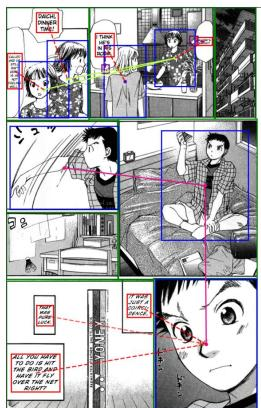
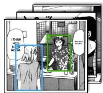
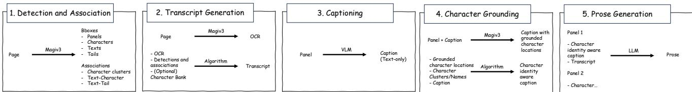
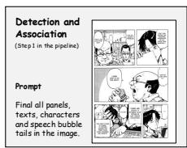
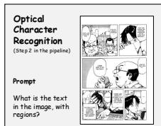
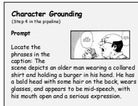
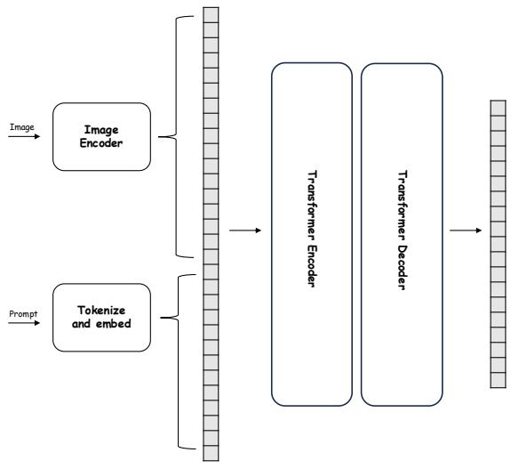
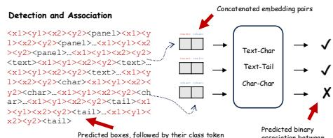

# From Panels to Prose: Generating Literary Narratives from Comics

Ragav Sachdeva Andrew Zisserman

Visual Geometry Group, Dept. of Engineering Science, University of Oxford

# Transcript Generation

  
<Daichi's mom>: Where's Daichi?   
<Yuki>: I think he's in his   
<Daichi's mom>: Daichi, dinner time! I called and he still isn't here. Is he not feeling well?   
<Daichi>: It was just a coincidence. That was pure luck. All you have to do is hit the bird and have it fly over the net right?

# Character-Grounded Panel Captioning

  
Figure 1. Our approach to transforming comics into accessible narratives begins with generating transcripts (left), capturing dialogue. In the image, green boxes represent panels, blue boxes represent characters, red boxes represent text, and purple boxes represent speech-bubble tails. Solid lines indicate character clusters, while dashed lines show associations between dialogues and their speakers. This is followed by character-grounded panel captioning (top-right), where grounded phrases are colour-coded, and their corresponding predicted character boxes are overlaid on the panel images, adding descriptions and placing characters in context. Finally, these elements are combined into prose (bottom-right), creating a rich, immersive narrative for visually impaired readers. Images ©YamatoNoHane by Saki Kaori.

The scene shows a young character[0] sitting cross-legged on a bed in a relaxed, casual bedroom setting. The bed has a rumpled look, with a soft blanket and pillow, giving a sense of comfort and informality. The character[0], dressed in a checkered shirt over a T-shirt, is holding up a small object, possibly a fan orhe scene captures a dynamic moment as a character[0] swiftly extends their[0] arm, suggesting a quick similar item, with a focused expression. Nearby, a few personal items lie scattered, including a bookforceful action, possibly throwing or releasing something with intent. The movement is accentuated by or notebook, adding to the lived-in feel of the room. The setting suggests a private momenotion lines trailing from the arm, conveying speed and energy. The character’s[0] expression appeascene shows two characters in a domestic setting, likely a kitchen area. One character[0], with of contemplation or introspection in a cozy, familiar environment. ocused and determined, with their[0] body slightly turned to enhance the sense of movement. Trt hair wearing a patterned shirt, stands behind a counter and appears to be speaking to the eckered shirt flares with the motion, adding to the visual impact of the gesture. The overall scer person[1], who has longer hair and is seen from behind. The counter is decorated with a bowl of phasizes action and concentration, highlighting the character’s[0] physical engagement in the momen seems to be fruit or a similar item, along with a small plant in a vase and a cup, adding to the homely osphere. In the background, there is a tiled wall with a large kitchen hood, cabinets, and other cal kitchen features, giving a sense of warmth and familiarity to the space.

# Prose

In this scene, a tall, imposing apartment building stretches upward under a darkened sky, with its balconies casting sharp shadows that emphasize the structure's height. Inside one of the apartments, two characters interact in a cozy kitchen setting. Daichi's mother, standing behind a counter filled with small homely items like a fruit bowl and a vase, is inquiring about her son, Daichi. Yuki, a young person with long hair, responds that Daichi is likely in his room.

As Daichi’s mother calls out to him, a hint of concern appears on her face. She wonders aloud if he’s unwell, as he hasn’t responded to her calls for dinner. The scene then shifts to Daichi, a young boy, sitting cross-legged on a slightly messy bed, absorbed in his thoughts. He holds a badminton shuttlecock in one hand, gazing at it with intensity.

Suddenly, Daichi thrusts his arm forward, sending the shuttlecock flying across his room with focused determination. It lands near his study desk, which is organized with books and personal belongings, adding a sense of familiarity to the space. His face, shown in a close-up, is filled with a fierce resolve, eyebrows furrowed and eyes wide, as if stirred by a significant realization or purpose.

Finally, the narrative zooms in on a cylindrical tube labeled “YONEX,” containing badminton shuttlecocks, lying on a wooden floor. Daichi’s thoughts reveal a blend of modesty and confidence. He reflects on his skill with a sense of humility, admitting that his recent success might have been pure luck. Nonetheless, he contemplates the basic essence of the game—simply hitting the shuttlecock to make it fly over the net, underscoring both the simplicity and challenge of the sport he’s engaged in.

# Abstract

Comics have long been a popular form of storytelling, offering visually engaging narratives that captivate audiences worldwide. However, the visual nature of comics presents a significant barrier for visually impaired readers, limiting their access to these engaging stories. In this work, we provide a pragmatic solution to this accessibility challenge by developing an automated system that generates text-based literary narratives from manga comics. Our approach aims to create an evocative and immersive prose that not only conveys the original narrative but also captures the depth and complexity of characters, their interactions, and the vivid settings in which they reside.

To this end we make the following contributions: (1) We present a unified model, Magiv3, that excels at various functional tasks pertaining to comic understanding, such as localising panels, characters, texts, and speech-bubble tails,

performing OCR, grounding characters etc. (2) We release human-annotated captions for over 3300 Japanese comic panels, along with character grounding annotations, and benchmark large vision-language models in their ability to understand comic images. (3) Finally, we demonstrate how integrating large vision-language models with Magiv3, can generate seamless literary narratives that allows visually impaired audiences to engage with the depth and richness of comic storytelling. Our code, trained model and dataset annotations can be found at: https://github.com/ ragavsachdeva/magi.

# 1. Introduction

Comics, as a unique blend of visual art and narrative, have captivated audiences for decades, transcending cultural and linguistic boundaries. This dynamic medium not only entertains but also communicates complex themes and emotions

through a combination of imagery and text. However, despite their widespread popularity, comics pose significant accessibility challenges for visually impaired readers. Traditional comic formats, reliant on intricate illustrations and visual storytelling techniques, often alienate those unable to perceive the visual elements.

Recent works have advanced manga accessibility by generating dialogue transcripts from manga, extracting text from speech bubbles and linking it to characters to provide a basic storyline [30, 31]. While valuable, this approach captures only part of the narrative, missing scene descriptions, character actions, and emotional cues essential to the story. A recent survey also shows that visually impaired readers desire descriptions of scenes, emotions, and character interactions, highlighting the need for a comprehensive approach [18]. Our work addresses this gap by producing a richer representation of the manga narrative, converting each page’s visual context into a descriptive, literary prose.

The task of manga-to-prose conversion is complex, requiring an understanding of manga’s unique visual storytelling, human behavior, character relationships, and narrative pacing. Unlike video, which flows through continuous motion, manga tells its story in static frames that capture key moments. Translating these frames into prose demands a grasp of language, character dynamics, and story flow, as well as the skill to connect and interpret isolated elements. This paper aims to develop an automated pipeline to capture these nuances and generate coherent prose, making manga narratives accessible to those who cannot perceive the visual content.

Our solution transforms manga pages into accessible prose through a structured, multi-step pipeline. First, we identify and associate essential elements on each page—panels, characters, text, and speech-bubble tails—linking characters with their dialogues and clustering recurring characters to ensure consistency. Optical Character Recognition (OCR) is then applied to extract text and generate a dialogue transcript in the original mangareading order, maintaining coherence, similarly to prior works [30, 31]. After this, each panel is captioned individually, capturing scenes, actions, and emotional cues. Importantly, characters mentioned in these captions are localised precisely within panels, grounding descriptions to specific visual regions and ensuring continuity across the panels. To transform these structured captions and dialogue into a cohesive text narrative, we leverage zero-shot prompting of foundational language models. This approach enables the model to generate prose without requiring extensive pretraining on manga-specific data. Additionally, while we default to prose for its immersive qualities, our approach is flexible: the model can also produce alternative formats, such as screenplay-style scripts, allowing users to select a narrative style that best suits their preferences.

In summary, our contributions are as follows:

• We introduce Magiv3, a unified model for manga analysis that performs tasks such as (i) detecting panels, characters, texts, and speech-bubble tails, (ii) associating texts with their speakers and tails, and characters with other characters (i.e., clustering), (iii) performing OCR while implicitly providing the reading order, and (iv) grounding characters in captions to visual regions in the image—all within a single framework, providing state-ofthe-art structured input for prose generation.   
• We propose a comprehensive manga-to-prose pipeline that transforms manga pages into coherent literary narratives, enhancing accessibility for visually impaired audiences. This approach leverages Magiv3 to understand key manga elements and employs zero-shot prompting with off-the-shelf VLMs/LLMs (both open-source and proprietary) to generate accurate and immersive prose.   
• We introduce PopCaptions1, a novel character-grounded captioning dataset specifically curated to evaluate the capabilities of vision-language models (VLMs) in manga captioning and prose generation. Additionally, we propose an LLM-based evaluation setup to systematically assess these capabilities.

# 2. Related Works

Comic understanding research spans tasks like panel detection [13, 24–26, 29–31, 42], text and speech balloon detection [3, 24, 25, 27, 30, 31], character detection [15, 17, 25, 30, 31, 36], re-identification [20, 28, 31, 32, 37, 47], and speaker identification [19, 20, 29–31]. Key datasets, including Manga109 [2, 3, 19], DCM [23], eBDtheque [11], and PopManga [30, 31], have driven advances in these tasks, though methods traditionally used separate models for each, e.g., detection, OCR, and panel ordering [30, 31].

Recent efforts have aimed to standardise resources in comic analysis. The Comics Datasets Framework [41] introduces Comics100, which broadens styles by including American comics and unified annotations for detection benchmarking. Expanding on this, CoMix [39] provides a multi-task benchmark covering tasks like detection, re-identification, reading order, and multimodal reasoning, supporting model generalisation across diverse comic styles. Recent studies also leverage multimodal models to enhance contextual understanding [14, 33, 40].

Comparison with prior methods. Our approach builds on the aforementioned advances, aiming to unify comic analysis tasks within a single framework to reduce reliance on multiple specialised models. We benchmark our method

  
Figure 2. Overview of the ‘Page to Prose’ Pipeline. The stages of the pipeline are described in section 3. Magiv3 is described in section 4, and the Captioning and Prose Generation in section 5.

against publicly available datasets and methods in Sec. 7 and further juxtapose the capabilities of our model with prior methods in the supplementary,

# 3. Page to Prose Pipeline

Given a collection of manga pages, our goal is to generate coherent literary prose that faithfully captures the original narrative and delivers an evocative reading experience. Manga images differ significantly from natural images due to their stylised, high-contrast visuals, non-standard layouts, and right-to-left reading orientation, which creates a unique distribution shift that conventional visionlanguage models struggle to interpret accurately. Furthermore, manga storytelling relies heavily on character continuity, emotional expression, and sequential panel-based narration, making the task of transforming static images into prose inherently complex. To address these challenges, we propose the multi-step pipeline shown in Fig. 2, as described below.

(1) Detection and Association. The initial step involves processing a manga page to localise the panels, characters, texts, and speech-bubble tails, and establish their relationships—character-character associations (i.e. clustering), text-character associations (i.e. speaker diarisation), and text-tail association (to assist with speaker identification).   
(2) Transcript Generation. Next, the dialogues are extracted using Optical Character Recognition (OCR), and along with the predicted speaker associations, a dialogue transcript is generated in the manga-reading order. This transcript may either include a unique ID for each character cluster, following the approach in Magi [30], or may include character names if a character bank is present, following the approach in Magiv2 [31].   
(3) Caption Generation. Subsequently, each predicted panel is cropped and processed to generate a self-contained but informative caption, describing the scene, the characters, their actions, etc. This step is performed independently per panel, where each caption is generated by a generalpurpose model using a short, concise zero-shot prompt that describes the image.   
(4) Character Grounding. Thereafter, each character referenced in the caption, e.g., “... a character with black

spiky hair ...”, is then localised in the panel image. This step is critical in tying the isolated panel descriptions to the broader storyline and linking the referenced characters to the identified clusters or named identities. This is accomplished by matching predicted boxes for grounded characters to the original boxes detected in step 1 using Intersection over Union (IoU) and bipartite matching, thus linking the grounded characters to their global identities.

(5) Prose Generation. Finally, all of the information above is processed by an LLM to generate a prose. This step is essential for transforming the fragmented data from previous steps into a single coherent and readable narrative, allowing for a clearer understanding of the manga’s storyline.

Despite the apparent complexity of solving numerous tasks outlined above, our solutions comprises of two models only: (i) Magiv3, a unified model that can detect characters, texts, panels, speech-bubble tails, match dialogues to their speakers, cluster characters, ground characters in captions, perform OCR and implicitly order texts and panels, and (ii) a large foundational vision-language model which is instruction finetuned and used zero-shot for panel captioning and prose generation. More details are provided below.

# 4. Detection, Association, OCR and Character Grounding

Previous approaches for manga analysis and transcript generation [30, 31] rely on multiple specialised models: a DETR-based backbone for detection, a separate cropembedding model to aid clustering, yet another model for OCR, and a post-processing algorithm for ordering elements through topological sorting. In contrast, we aim to achieve all these tasks (and more) within a single framework, using one set of model weights. Since the inputs and outputs can be heterogeneous depending on the task (e.g. image boxes for detection, image+text text+boxes for character grounding) we employ a transformer-based multimodal encoder-decoder architecture and adopt a sequenceto-sequence framework, inspired by Florence-2 [43]. In other words, given a high resolution manga image as input, along with a task-specific prompt, our model—Magiv3— predicts the output as a sequence of tokens in an autoregressive fashion. Fig. 3 shows an overview.

Figure 3. The Magiv3 architecture and its three use cases. The input to the model is an image and prompt pair. The output is text-only (tokens) predicted autoregressively for each of the three use cases. Images: ©HanzaiKousyouninMinegishiEitarou by Ki Takashi.   
  
Don't use words like "Hostage, surrender, or lay down your weapons"... <x1><y1><x2><y2>This will cause a problem...<x1><y1><x2><y2>...<x1><y1><x2><y2>That'll be good for now.<x1><y1><x2><y2>Now we just have to...<x1><y1><x2><y2>Learn how to do this right.<x1><y1><x2><y2>...<x1><y1><x2><y2>There are usually 1 stages that occur in any crisis situation...<x1><y1><x2><y2>*Click*<x1><y1><x2><y2>The first stage is anger. It occurs during the first hour when tempers are highest.<x1><y1><x2><y2> OCR texts, followed by their locations

Optical Character Recognition

Character Grounding

The scene depicts an older man<x1><y1><x2><y2> wearing a collared shirt and holding a burger in his<x1><y1><x2><y2> hand. He<x1><y1><x2><y2> has a bald head with some hair on the back, wears glasses, and appears to be mid-speech, with his<x1><y1><x2><y2> mouth open and a serious expression.

Caption, with interleaved boxes corresponding to character referring phrases.

# 4.1. Magiv3 Architecture

Image Encoder. A high resolution manga image $I \in$ $\mathbb { R } ^ { 3 \times { \bar { H } } \times W }$ is processed by a dual attention vision transformer [9] which extracts dense image features $\boldsymbol { g } \in \mathbb { R } ^ { c \times v }$ .

Prompt Encoder. A text-based task prompt $T$ is first tokenized and emedded using a word-embedding layer, resulting in features h ∈ Rc×t. $\boldsymbol { h } \in \mathbb { R } ^ { c \times t }$

Multi-Modal Transformer Encoder. A standard transformer encoder jointly processes the concatenated vision and language embeddings, $[ g \parallel h ] \ \in \ \mathbb { R } ^ { c \times ( v + t ) }$ , to output contextualised features $j \in \mathbb { R } ^ { c \times ( v + t ) }$ .

Auto-regressive Transformer Decoder. A standard transformer decoder, with casual self-attention, cross attends to the input features $j$ , and predicts the output tokens autoregressively.

Association Heads. Additionally, there are three association heads, which are simple MLPs similar to [31], and are used to predict text-character, character-character and texttail associations, as shown in Fig. 3.

# 4.2. Task Formulations

We tackle the manga image analysis problem by breaking it down into three distinct tasks: detection and association, OCR, and character grounding. Each of these tasks is handled independently, with a different prompt for each, but using the same set of model weights. This approach offers two main advantages: first, some tasks are inherently sequential (e.g., panel-level captions require predicting panel boxes first), and second, handling them separately enables more manageable context length for the model. These are the three tasks that Magiv3 is used for in the pipeline of the previous section, as illustrated in Fig. 2.

(1) Detection and Association: Given a manga page as input, the model is expected to output bounding boxes for panels, characters, texts, and speech-bubble tails, and to associate texts to characters, characters to other characters, and texts to tails. This is done with a single prompt, as shown in Fig. 3. Similar to prior works [30, 31], we formulate this as a graph generation problem, where the predicted boxes serve as the nodes, and the predicted associations form the edges. The model outputs the location tokens for bounding boxes, representing their quantized coordinates using 1000 bins (similar to [5, 6, 43]), followed by their class tokens (one of <panel>, <char>, <tail>, <text>). Since autoregressive generation inherently follows a specific order, we designed Magiv3 to output the boxes in manga-reading order (top to bottom, right to left), eliminating the need for an extra ordering step. These form the nodes of the graph.

To obtain the edges, we do not predict any edge-specific tokens, since the number of edges could grow quadratically in relation to the number of nodes. Instead, we take the feature embeddings corresponding to each predicted class token from their last hidden state and process them in pairs via the association MLPs, resulting in a binary score that represents whether there is an edge between two nodes.

(2) OCR: The second task involves extracting all the text from the manga page, along with its locations in the image, as shown in Fig. 3. This is done by running the model a second time with a different prompt. The model is tasked with outputting the text in the reading order, along with their corresponding bounding box coordinates. An example is shown in Fig. 3. It is important to note that the text locations are output twice: once in the detection step (critical

for associating texts with characters or speech bubbles), and once here in the OCR step, to associate the text with the corresponding location. The two outputs are reconciled easily by IoU based Hungarian matching.

(3) Character Grounding: In this step, given a manga panel and its caption as input, the model is expected to ground all the characters referred to in the caption. This process involves identifying character-referencing phrases in an openvocabulary setting, such as ‘boy’, ‘girl’, ‘mysterious figure’, ‘character on the right’, ‘bald man’, as well as pronouns like ‘he’, ‘she’, and ‘they’. The model is tasked with locating these referenced characters within the panel, as shown in Fig. 3. Please see the supplementary on an alternative way to solve this character grounding problem.

# 4.3. Implementation

The input to the model is an image $I$ and a text prompt $T$ . The image $I$ is resized to $7 6 8 \times 7 6 8 \mathrm { p x }$ and processed by the DaViT [9] model, resulting in flattenend “visual token embeddings” $g ~ \in ~ \mathbb { R } ^ { 1 0 2 4 \times 5 7 7 }$ . The text prompt $T$ is tokenized and embedded using a word-embedding layer, resulting in “prompt token embeddings” $h \in \mathbb { R } ^ { 1 0 2 4 \times t }$ . The image token embeddings and the prompt token embeddings are concatenated resulting in the multi-modal input. This concatenated input is fed into a standard encoded-decoder transformer [38], comprising 12 layers each, with hidden dimension of 1024 and 16 attention heads. This transformer generates the output tokens in an auto-regressive fashion. In the case of edge prediction, the final features corresponding to class tokens are processed in pairs by 3-layered MLPs to make a binary prediction towards the presence or absence of the edge. The model was initialised used Florence-2 weights [43] and trained on $2 \times \mathrm { A 4 0 }$ GPUs, with an effective batch size of 32, using AdamW [22] optimiser with learning rate of 1e-4.

# 5. Captioning and Prose Generation

Complementing the structural and relational analysis, the other part of our pipeline focuses on the generation of descriptive and narrative text, transforming the manga’s visual elements into a flowing literary form. While manga images are rich in expressive details and complex character interactions, faithfully capturing this information in text is challenging, especially due to the lack of suitable training data. Therefore, we leverage existing large vision-language models (both open-source and proprietary) to perform these tasks in a zero-shot setting.

# 5.1. Caption Generation

The task of captioning manga panels is particularly challenging due to the lack of suitable training datasets. As such, we rely on zero-shot captioning results from off-theshelf vision-language models. In the caption generation

stage, we adopt a panel-by-panel approach, where each manga panel is processed individually to generate its caption. This method allows us to preserve high-resolution details and ensures the model’s attention remains focused on the unique elements of each panel—such as the setting, character emotions, and background details—while explicitly instructing it to ignore any embedded text, which it generally misinterprets and misattributes. We provide further discussion around this in Sec. 7, and show example predictions in Figs. 4 and 5.

# 5.2. Prose Generation

In this final stage of our pipeline, we generate coherent narrative prose that accurately reflects the manga’s storyline. Given the lack of suitable training data for this task, we rely on an instruction-finetuned large language model in a zeroshot setup, leveraging its ability to synthesise context across multiple components. For each panel on a manga page, we input both the dialogue transcript—complete with speaker associations—and the generated caption, which provide the spoken content and visual details. These panel-specific inputs are organised in the correct reading order and fed as structured input to the model. The model is then tasked with creating a continuous narrative that flows across the panels, transitioning smoothly from one scene to the next. Since the transcripts and captions are “character aware,” with consistent labels (or names, if available) for characters across panels, the model ensures character continuity and coherence throughout the generated prose.

Beyond basic narrative cohesion, the prose generation process also allows for flexibility in style. The output can vary in length, tone, and level of complexity, ranging from concise, child-appropriate summaries to more elaborate or formal narratives. This flexibility is enabled by zero-shot prompting, allowing the model to adapt to different styles and requirements. As a result, the prose generation process can produce a virtually limitless range of outputs, tailored to different audiences or use cases. The exact prompt used to generate results in Fig. 6 is provided in the supplementary material.

# 6. PopCaptions: A Dataset for Character-Aware Manga Understanding

We introduce PopCaptions, a novel dataset of 3,374 captioned manga panels, drawn from 15 randomly selected chapters of the PopManga test set [30] spanning 694 manga pages. These panels are diverse in content and style, and the labelled captions offer highly descriptive, characteraware annotations that go beyond conventional captioning datasets. Each caption is crafted to capture the unique storytelling style of manga, going beyond simple image descriptions like “a black and white cartoon image” to provide detailed accounts of character actions, emotions, and